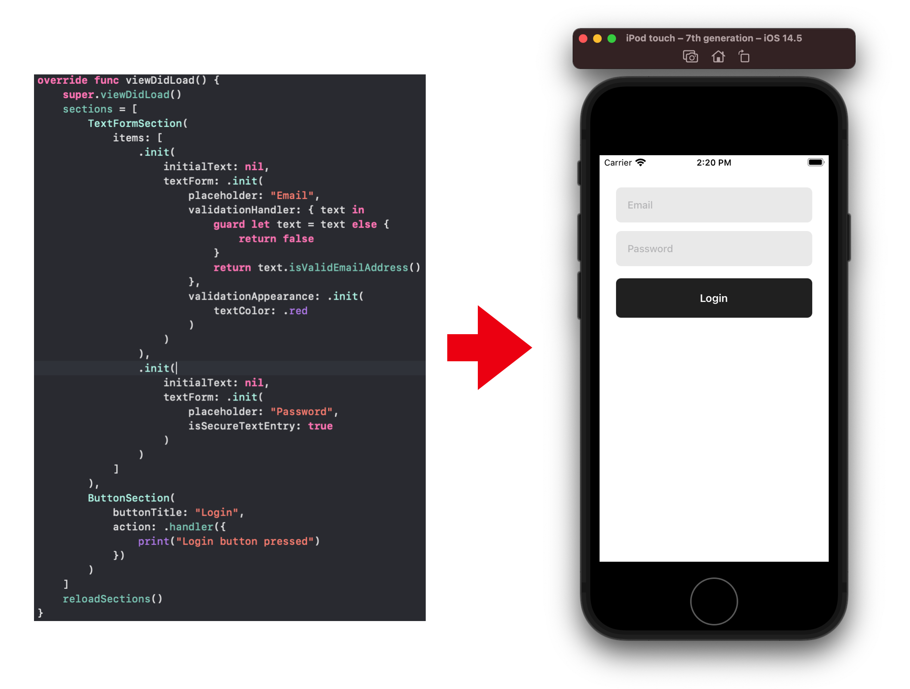

# CompositionalLayoutViewController

[](https://travis-ci.org/Akira/CompositionalLayoutViewController)
[](https://cocoapods.org/pods/CompositionalLayoutViewController)
[](https://cocoapods.org/pods/CompositionalLayoutViewController)
[](https://cocoapods.org/pods/CompositionalLayoutViewController)



## Example

To run the example project, clone the repo, and run `pod install` from the Example directory first.

## Requirements

iOS 13.0+

## Installation

CompositionalLayoutViewController is available through [CocoaPods](https://cocoapods.org). To install
it, simply add the following line to your Podfile:

```ruby
pod 'CompositionalLayoutViewController'
```

## Usage
There are four steps to declare collection view.

Firstly, to compose complex collection view sections, you implement `Section` class that inherits `HashableObject` and `CollectionViewSection`.
```swift
class TextFormSection: HashableObject, CollectionViewSection {
    ...
}
```

Secondly, 
```swift
func layoutSection(environment: NSCollectionLayoutEnvironment) -> NSCollectionLayoutSection
```

Thirdly, register cells and supplementary views for collection view in `func registerCell(collectionView: UICollectionView)` and `func registerSupplementaryView(collectionView: UICollectionView)`.
```swift
func registerCell(collectionView: UICollectionView) {
    // register cells here
}
```

```swift
func registerSupplementaryView(collectionView: UICollectionView) {
    // register supplementary views here
}
```
Make sure that you implement `func supplementaryView(_ collectionView: UICollectionView, kind: String, indexPath: IndexPath) -> UICollectionReusableView?`.
You may have to deque `UICollectionReusableView` from a collection view.

These cells and supplementary views are configured following methods.
```swift
func configuredCell(_ collectionView: UICollectionView, indexPath: IndexPath) -> UICollectionViewCell
```

```swift
func configureSupplementaryView(_ view: UICollectionReusableView, indexPath: IndexPath)
```

You also have to declare `var snapshotItems: [AnyHashable]` in your section class.
This variable contains datas for each cells.
```swift
var snapshotItems: [AnyHashable] {
    // return AnyHashable items
}
```


Finally, you can declare collection view sections in subclass of `CompositionalLayoutViewController` as follows:
```swift
sections = [
    TextFormSection(
        items: [
            .init(
                initialText: nil,
                textForm: .init(
                    placeholder: "Email",
                    validationHandler: { text in
                        guard let text = text else {
                            return false
                        }
                        return text.isValidEmailAddress()
                    },
                    validationAppearance: .init(
                        textColor: .red
                    )
                )
            ),
            .init(
                initialText: nil,
                textForm: .init(
                    placeholder: "Password",
                    isSecureTextEntry: true
                )
            )
        ]
    ),
    ButtonSection(
        buttonTitle: "Login",
        action: .handler({
            print("Login button pressed")
        })
    )
]
reloadSections()
```

To handle cell selection, override `func didSelectItem(at indexPath: IndexPath)` method in subclass of `CompositionalLayoutViewController`.

See example code to lean advanced usage.

## Author

Akira, akira.matsuda@me.com

## License

CompositionalLayoutViewController is available under the MIT license. See the LICENSE file for more info.
